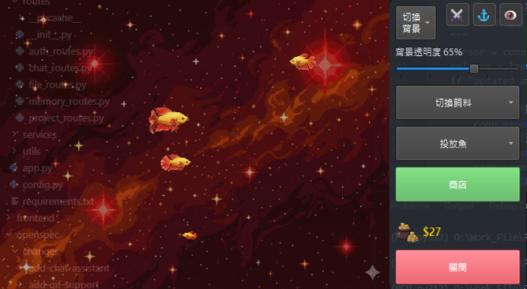

# 🐠 Desktop Feeding Fish

一個使用 PyQt6 開發的桌面養魚遊戲應用程式，採用透明視窗技術，讓您可以在桌面上飼養和照顧虛擬魚類，提供類似 Insaniquarium 的互動式桌面寵物體驗。


## 📸 預覽

### 截圖展示

<div align="center">
  
</div>

### 影片展示

<div align="center">
  
  **📹 [點擊下載並觀看完整演示影片](sample/Demo_video.mp4)**
  
  <a href="sample/Demo_video.mp4" title="點擊下載演示影片">
    
  </a>
  
  <p><em>點擊上方圖片下載並觀看完整演示影片</em></p>
  
</div>

## ✨ 主要功能

- 🪟 **透明視窗**：視窗背景透明，只有水族箱區域可見，不干擾日常工作
- 🐟 **多種魚類**：支援多種魚類，每種都有獨特的外觀、行為和屬性
- 🍽️ **餵食系統**：投放不同類型的飼料來餵養魚類，每種飼料有不同的效果
- 🦈 **怪物機制**：不定時出現的敵對實體，需要點擊擊敗以保護魚類
- 🏪 **商店系統**：購買新的魚類、寵物和工具
- 🐾 **寵物系統**：飼養各種寵物，包括龍蝦、寶箱怪等
- 💰 **經濟系統**：收集金幣，購買物品，升級設施
- 🎨 **多種背景**：多種精美的水族箱背景可供選擇
- 💾 **存檔系統**：自動保存遊戲進度
- ⚙️ **自動投食機**：設定自動投食，解放雙手

## 🚀 快速開始

### 環境要求

- Python 3.12+
- Windows 10/11（主要支援平台）
- PyQt6 6.6.0+

### 安裝步驟

1. **克隆專案**
   ```bash
   git clone https://github.com/gcobs051094/Desktop_Aquarium.git
   cd Desktop_Aquarium
   ```

2. **安裝依賴**
   ```bash
   pip install -r requirements.txt
   ```

3. **運行應用程式**
   ```bash
   python aquarium_window.py
   ```

### 編譯為執行檔（可選）

使用 PyInstaller 將應用程式打包為獨立的執行檔：

```bash
build_exe.bat
```

執行檔將生成在 `dist/` 目錄中。

## 🎮 使用說明

### 基本操作

- **點擊水族箱**：投放飼料
- **點擊怪物**：擊敗怪物，保護魚類
- **點擊金幣**：收集金幣
- **右鍵選單**：開啟設定、商店等選單
- **拖拽視窗**：移動水族箱位置

### 遊戲機制

#### 餵食系統
- 點擊水族箱區域投放飼料
- 不同飼料提供不同的成長度
- 魚類需要定期餵食以維持生命

#### 魚類生命週期
- 魚類會自動游動和轉向
- 餵食可以讓魚類成長
- 長時間不餵食會導致魚類死亡

#### 商店系統
- 購買新的魚類和寵物
- 購買工具（如自動投食機）
- 升級現有設施

#### 寵物系統
- 飼養各種寵物，每種寵物有獨特的行為
- 寵物可以幫助收集金幣或提供其他功能

## 🛠️ 技術棧

- **Python 3.12** - 主要開發語言
- **PyQt6** - GUI 框架，用於創建透明視窗和桌面應用程式界面
- **Pillow** - 圖像處理和資源管理
- **NumPy** - 數值計算支援

## 📁 專案結構

```
Desktop_Feeding_Fish/
├── aquarium_window.py      # 主應用程式檔案
├── fish.py                  # 魚類類別和行為邏輯
├── pet.py                   # 寵物類別和行為邏輯
├── game_state.py            # 遊戲狀態管理（存檔/讀檔）
├── config.py                # 遊戲配置和參數
├── requirements.txt         # Python 依賴套件
├── build_exe.bat           # 編譯執行檔腳本
├── resource/                # 遊戲資源目錄
│   ├── background/          # 背景圖片
│   ├── feed/                # 飼料動畫
│   └── ...                  # 其他資源
├── tools/                   # 開發工具
│   ├── image_cutter_gui.py  # 圖片裁切工具
│   └── alpha_dfs_crop.py    # 透明區域裁切工具
├── sample/                  # 範例展示
│   ├── Demo_Img.png        # 截圖
│   └── Demo_video.mp4      # 影片
└── openspec/               # 專案規格文檔
```

## 🎯 核心特性詳解

### 透明視窗技術
- 使用 `FramelessWindowHint` 創建無邊框視窗
- 使用 `WindowStaysOnTopHint` 讓視窗保持在最上層
- 使用 `WA_TranslucentBackground` 實現透明背景
- 使用 `setMask()` 設定只有水族箱區域可以接收滑鼠事件

### 魚類行為系統
- 自動游動和轉向
- 追蹤飼料行為
- 邊界檢測和避障
- 多種動畫狀態（游泳、轉向、進食、死亡等）

### 遊戲經濟系統
- 金幣收集機制
- 商店購買系統
- 升級系統
- 里程碑達成獎勵

## 🔧 開發工具

專案包含多個開發工具，位於 `tools/` 目錄：

- **圖片裁切工具** (`image_cutter_gui.py`)：用於裁切和分類遊戲資源圖片
- **透明區域裁切工具** (`alpha_dfs_crop.py`)：自動檢測並裁切透明區域

## 📝 開發規範

- 遵循 PEP 8 Python 編碼規範
- 使用類型提示（Type Hints）提高代碼可讀性
- 模組化設計，分離業務邏輯和 UI 層
- 使用語義化的 Git 提交訊息

## 🤝 貢獻

歡迎提交 Issue 和 Pull Request！

1. Fork 本專案
2. 創建您的特性分支 (`git checkout -b feature/AmazingFeature`)
3. 提交您的更改 (`git commit -m 'Add some AmazingFeature'`)
4. 推送到分支 (`git push origin feature/AmazingFeature`)
5. 開啟一個 Pull Request

## 📄 授權

本專案採用 MIT 授權條款

## 👤 作者

**gcobs051094**

- GitHub: [@gcobs051094](https://github.com/gcobs051094)
- 專案連結: [https://github.com/gcobs051094/Desktop_Aquarium](https://github.com/gcobs051094/Desktop_Aquarium)

## 🙏 致謝

- 感謝 PyQt6 團隊提供優秀的 GUI 框架
- 靈感來自經典遊戲 Insaniquarium

## 📞 聯絡方式

如有問題或建議，請透過以下方式聯絡：

- 開啟 [Issue](https://github.com/gcobs051094/Desktop_Aquarium/issues)
- 發送 Pull Request

---

⭐ 如果這個專案對您有幫助，請給我們一個 Star！
